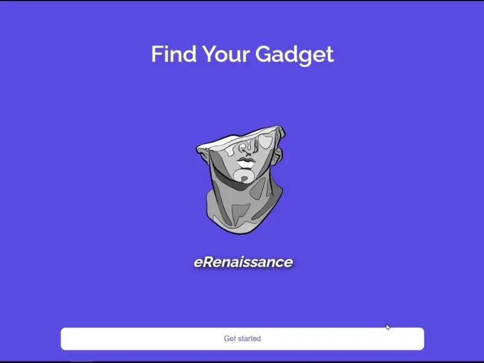

  
    
  

 

 
  Asking a lot of questions and solving problems with the code I write. Growing up curious and in pursuit of personal excellence and development made me question how things around me work and how they could be improved. From dreading using calculators and creating an app that shows the formula, solution, and answer in one click as a finance student to making full-stack web applications, I realized that the only way to satisfy my curiosity was by writing lines of code that simply work.

 

---

<h1 align="center">Projects</h1>

	<table>
		<tr>
			<!--project 1 -->
			<td width="50%">
				<h3 align="center" color="white">Filipino Restaurant</h2>
				
 
					
					 
					 
					

                        <!--repo --> 
						  
                        <!--live site --> 
							
					

					
<strong>HTML5 CSS3</strong> - Fictional Filipino restaurant

				

			</td>
			<!--project 2 -->
			<td width="50%">
				<h3 align="center" color="white">Darc & Decadent</h2>
				
 
					
					 
					 
					

                        <!--repo --> 
						  
                        <!--live site --> 
							
					

					
<strong>HTML5 CSS3</strong> - Fictional Chocolate Bakery

				

			<!--project 3 -->
			<td width="50%">
				<h3 align="center" color="white">Ecommerce</h2>
				
 
					
					 
					 
					

                        <!--repo --> 
						  
                        <!--live site --> 
							
					

					
<strong>MONGODB EXPRESS REACT NODE</strong> - MVP Ecommerce Store

				

			</td>
	</table>

